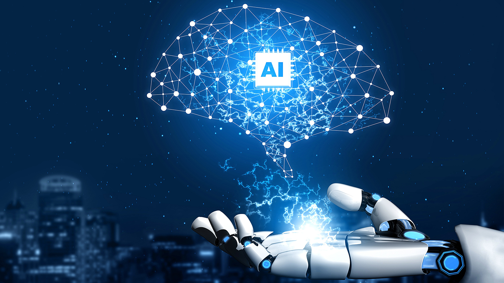

## I. Introduction

AI has become a regular part of how students learn, especially in technical fields like software engineering. Tools like ChatGPT, Claude, GitHub Copilot, and Gemini have shifted from novelty to utility, showing up in everything from debugging sessions to assignments. In ICS 314, AI was a consistent part of my workflow. Over the course of the semester, I developed a pretty honest sense of where it helps, where it falls short, and what it actually means to use it responsibly as a student learning to code.

## II. Personal Experience with AI

### Experience WODs (e.g. E18)

For WODs, I leaned on ChatGPT and Claude fairly often. I would paste the portion of the requirement I needed assistance with and ask AI to generate an initial solution. This helped me understand the general direction I needed to take and I would adjust the code to the assignment if needed. The downside was that AI sometimes gave me more than I asked for — overly complex solutions with extra logic I didn't need and couldn't always follow. I made it a habit to not just paste whatever it gave me. I would read through the code, cut what didn't belong, and make sure I understood what the remaining parts were actually doing.

### In-class Practice WODs

For practice WODs, I used AI similarly — mostly to get unstuck or to sanity-check my approach. Since these weren't graded, I treated them as a chance to experiment with how I prompted and how useful the output actually was. Sometimes it worked cleanly; other times it produced something that technically ran but didn't match the spirit of the exercise.

### In-class WODs

During graded in-class WODs, the time pressure made AI more tempting but also more risky. I'd ask things like "explain how this function works" or "what's the general structure for doing X in JavaScript." The risk was that a bad or irrelevant response could cost me time I didn't have. A few times the AI didn't fully understand what I was asking and gave something completely off, which forced me to re-prompt or just figure it out on my own. That said, when the prompt was specific and clear, it was a genuine help.

### Essays

I didn't use AI to write my essays from scratch, but I did use it to clean up my writing — reformatting sentences, smoothing out flow, and making certain explanations sound more technical and precise. The ideas and reflections were my own, but AI helped present them in a way that read more clearly and professionally.

### Final Project

Our final project was a virtual bulletin board. AI was probably most useful here out of everything in the course. The Next.js template we had from class didn't cover everything we needed, so I used AI to help bridge those gaps — connecting form fields to the database, wiring up authentication, building out certain pages, and handling some of the styling quickly so we could keep moving. I'd ask things like "how do I connect this form field to my schema" or "how do I protect this route with authentication." It wasn't always perfect, but it gave me a solid starting point I could adapt and edit.

### Learning a Concept / Tutorial

When documentation felt dense or unclear, I'd ask AI to break it down in plain terms. Something like "explain what this function does and when you'd use it" was a lot faster than reading through a full MDN page. This worked well for understanding individual concepts in isolation, though I had to be careful because AI sometimes oversimplified or left out important nuances.

### Answering a Question in Class or in Discord

I didn't really use AI for this. When answering questions in class or on Discord, I either knew the answer or I didn't. Using AI to answer on someone else's behalf felt like it missed the point of those conversations.

### Asking or Answering a Smart Question

I used AI to help me understand a problem well enough to ask a better question. If something wasn't clicking, I'd talk it through with AI first so I could articulate what I was actually confused about instead of posting a vague question. This made my smart questions more specific and easier for others to help with.

### Coding Examples

When I needed to see how something worked in practice, I'd ask for a quick example — something like "give me an example of using Underscore's .pluck method." This was one of the more reliable uses. Short, concrete examples are something AI handles well, and seeing a working snippet in context made concepts stick faster than just reading about them.

### Explaining Code

I used AI regularly to explain code I wrote and code I found as references. Pasting in a function and asking "what does this do and how does it work" was genuinely useful. It helped me understand what I was working with before modifying it, which reduced the chance of breaking something I didn't fully understand.

### Writing Code

AI helped me write code throughout the course, but I tried to stay involved in the process rather than just accepting whatever it produced. The output was often verbose — extra lines, overly complex logic, things that didn't apply to my specific setup. I'd have it generate a rough version, then trim it down, simplify it, and make sure it fit what I was actually building. The goal was to use it as a drafting tool, not a replacement for thinking.

### Documenting Code

I used AI to help format and clean up my documentation. It was good at taking rough inline comments and making them consistent and readable. I also had it remove redundant lines and tighten up the overall structure so the code was easier to follow.

### Quality Assurance

For ESLint errors and general code issues, I'd paste the problematic section and ask what was wrong. This worked well for straightforward issues. For more complex bugs, AI was hit or miss — sometimes it identified the problem immediately, other times it gave a confident-sounding but completely wrong diagnosis. I learned to treat its suggestions as one possible explanation rather than the answer.

### Other Uses

One thing I used AI for fairly consistently was generating edge cases. When I had a function I thought was working, I'd ask AI to think of inputs that might break it. This was a habit I picked up that genuinely improved the reliability of my code, and it's something I plan to keep doing.

## III. Impact on Learning and Understanding

Using AI heavily throughout ICS 314 had a real impact on how I learned — both good and complicated. On the positive side, it lowered the barrier to getting unstuck. There were moments where I had no idea where to start, and having something explain the shape of a solution gave me enough to move forward. Over time, I got better at reading code I didn't write, which is a skill in itself.

The tricky part is the line between using AI as a learning tool and using it as a crutch. When I just copied code without understanding it, I'd hit a wall the moment something broke or needed changing. The times I made myself read through the output and understand what it was doing — even though it wasn't perfect — I retained more and could build on it. The discipline of not just pasting and submitting was something I had to actively maintain.

## IV. Practical Applications

The final project was the closest thing to a real-world application of AI in this course. Building the virtual bulletin board required integrating pieces that weren't covered in class, and AI helped fill those gaps in a way that felt practical rather than academic. It was less about learning a concept and more about getting something built — which is often how software development actually works. That experience gave me a sense of how AI fits into a real workflow: useful for bridging gaps and speeding up familiar tasks, but still requiring judgment about when to trust it and when to dig deeper.

## V. Challenges and Opportunities

The biggest challenge with AI in this course was inconsistency. The same type of prompt could produce a clean, useful answer one time and something completely off the next. AI also doesn't ask clarifying questions the way a person would — it makes assumptions and runs with them, which sometimes led to responses that missed the point entirely. Context retention was another issue; longer conversations sometimes felt like the model had forgotten earlier details.

That said, the opportunity is clear. AI can make software engineering education more accessible by giving students a responsive resource to work through confusion in real time. The key is building enough structure around its use so that students are engaging critically with the output rather than just accepting it.

## VI. Comparative Analysis

Traditional teaching — WODs and structured assignments — built a foundation that AI alone couldn't have provided. The hands-on repetition of WODs created muscle memory for problem-solving patterns that stuck because I had to work through them myself. AI supplemented that but couldn't replace it. Where traditional methods struggled was in the moments between understanding and application — when I knew the concept but couldn't get the code to work. That's where AI filled a genuine gap. The two approaches worked better together than either would have alone.

## VII. Future Considerations

AI is going to keep getting better at code generation, explanation, and debugging. For software engineering education, the challenge isn't whether to incorporate it, but how to teach students to use it well. That means developing judgment about when AI output is trustworthy, how to prompt effectively, and how to stay intellectually engaged even when AI is doing a lot of the heavy lifting. Courses that treat AI as a tool to be understood — rather than a shortcut to be banned or blindly trusted — will produce better engineers.

## VIII. Conclusion

ICS 314 gave me a real education in how to work alongside AI rather than just through it. The tools I used each had their strengths and their blind spots, and figuring out which to reach for and when became its own kind of skill. The most important habit I developed was staying engaged with the output: reading it, questioning it, cutting what didn't belong. AI made me faster, but the understanding still had to come from me. That balance is something I'll carry into every project going forward.