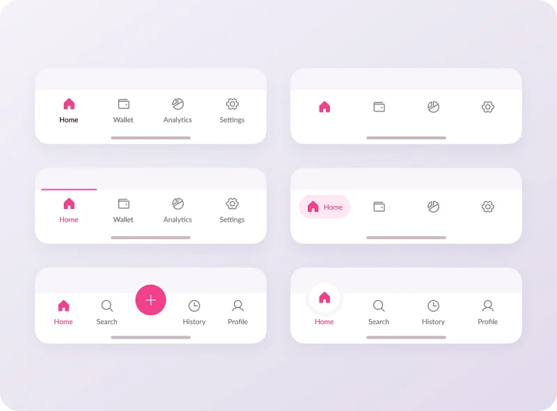

## The Illusion of Simplicity

  

When I first began learning HTML and CSS, everything felt pretty straightforward and simple. A few lines of code could create headings, paragraphs, or change the background and text color. Adjust a color property, and the mood of the page changes. At that level, web design felt approachable.

However, that sense of simplicity faded quickly when we moved beyong static text and basic styling into full user interface design. I was no longer adding just text and changing colors; I was building navigation bars, structuring layouts, and thinking about spacing, alignments, and responsiveness. A "simple" navigation bar required lists, achors, hover states, automatic adjustments to the screen size, and so much more. That was the moment I realized that modern UI design is hiding the complexities behing a "simple" and sleek looking outcome.

So why not just stick with raw HTML and CSS? For a small personal project, that's probably fine. But once a project starts growing, things get messy fast. Without some kind of structure, you end up with inconsistent buttons, mismatched colors, and spacing that looks slightly different on every page. Every little change becomes a hunt through your entire codebase. It stops being fun and starts feeling like a chore.

## The Power of Bootstrap 5

I was then introduced to Bootstrap 5 — premade classes for design. I expected it to make things easier. However, it felt overwhelming at first. There were so many class names to learn, and it wasn't always obvious why a layout wasn't behaving the way I expected. I spent a lot of time confused, second-guessing myself, and wondering if raw CSS would have just been faster. It genuinely felt like learning a whole new language on top of one I was still getting comfortable with.

But once things started clicking, the payoff became clear. Bootstrap gives you a consistent foundation — buttons, grids, forms, and spacing all follow the same rules across your entire project. Instead of figuring out flexbox from scratch every time, I could reach for a pattern I already knew worked. The struggle upfront was real, but it was a one-time investment. After that, building layouts got noticeably faster and more consistent.
At the end of the day, Bootstrap 5 isn't about avoiding CSS. It's about working smarter. The time you spend learning it — even the frustrating parts — pays off in a cleaner, more consistent project that's easier to maintain. Totally worth it.
