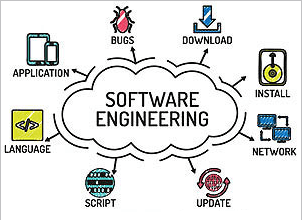

## The Bigger Picture

Before taking ICS 314, I thought software engineering was mostly about coding — sitting down, coming up with an idea, and building it from scratch. I expected to write a lot of code, and I did. What I didn't expect was how much of the work had nothing to do with the code itself. Managing a project, agreeing on how code should look and be structured, thinking through how features connect before writing a single line. All these things turned out to matter just as much as the implementation. The three concepts that stuck with me the most were coding standards, agile project management, and design patterns. Each of them changed how I think about building software in ways that go well beyond web development.

## Coding Standards: Rules That Actually Matter

Coding standards are agreed-upon rules for how code should be written. For example, things like how to name variables, how to format indentation, when to leave comments, and how to structure files. On the surface, it sounds like busywork. At first, I treated ESLint errors as obstacles to get past rather than signals worth paying attention to. But over the course of the project, I started to understand why they exist.

When multiple people are working on the same codebase, inconsistency quietly becomes a real problem. If everyone writes code in their own style, reading someone else's work starts to feel like reading a different language even when it's technically the same one. Debugging becomes harder. Onboarding a new teammate takes longer. Small inconsistencies pile up and make the codebase harder to trust.

## Agile Project Management: Small Steps Toward a Big Goal

Agile project management is an approach to building software that emphasizes working in short, focused cycles rather than planning everything out in advance and executing a single long plan. The core idea is that requirements change, problems come up that you couldn't predict, and it's better to adapt frequently than to commit to a rigid plan that might not survive contact with reality.

In ICS 314, we used a specific style called Issue Driven Project Management. The idea is straightforward: all work is broken down into individual issues, each representing a specific, concrete task. Every issue gets assigned to someone, tracked in a project board, and moved through stages like "in progress" and "done." Nothing gets worked on unless there is an issue for it, and every issue is small enough to be completed in a few days.

What I learned the hard way was the gap between the big picture and the details hiding inside it. When we planned the virtual bulletin board, we thought about the major features — user profiles, posted flyers, an admin view. That felt manageable. What we didn't fully account for were all the smaller pieces those features depended on: form validation, route protection, error states, edge cases for different user roles, styling that had to stay consistent across pages. Each of those became its own issue, and there were a lot more of them than we expected.

That experience made me appreciate Issue Driven Project Management not as a formality but as a genuine tool for staying grounded. It forces you to stop thinking in vague features and start thinking in concrete, completable tasks. I could see myself using this same approach in contexts that have nothing to do with web apps — organizing a research project, managing the development of a game, or coordinating any team effort where the work needs to be divided, tracked, and actually finished.

## Design Patterns: Solving Problems That Have Already Been Solved

Design patterns are well-established solutions to problems that come up repeatedly in software development. The value is that they give developers a shared vocabulary and a proven approach, so you're not reinventing the wheel every time you hit a common problem.

During the final project, we ended up following several patterns without explicitly naming them at the time. The most significant was separating the code that manages data from the code that displays it to the user, with a clear layer in between handling interactions. This separation — commonly called the Model-View-Controller pattern — made it much easier to change one part of the system without accidentally breaking another. When we needed to update how a form looked, we didn't have to touch the database logic. When we changed how data was stored, the UI didn't need to be rewritten.

Design patterns matter beyond web development because the underlying problems they solve are universal. Any system complex enough to have multiple moving parts will eventually run into questions about how those parts should talk to each other, who should be responsible for what, and how to make changes without cascading failures. Whether you're building a desktop application, a game engine, or a command-line tool, the same structural problems come up. Having a pattern to reach for means not having to figure out the answer from scratch every time.

## What Software Engineering Actually Is

By the end of this course, my understanding of software engineering had shifted pretty significantly. It's not just about writing code that works. It's about writing code that other people can read, maintaining a project that other people can contribute to, managing a team effort that doesn't collapse under its own complexity, and building systems with enough structure to grow without breaking. Coding standards, project management, and design patterns each address a different part of that challenge. They're tools for working with other people and with future versions of yourself, and I think they apply anywhere software is being built seriously.