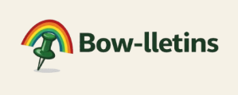

[Bow-lletins](https://github.com/bowlletins) is a centralized digital bulletin board designed for UH Mānoa students. The platform allows students to post and browse opportunities such as jobs, internships, study groups, events, and campus announcements — all in one searchable place.

## The Problem

Students at UH Mānoa often miss out on opportunities because information is scattered across physical bulletin boards, mass emails, and various social media platforms. There is no single, organized hub for campus-related postings, making it easy for important announcements to go unnoticed.

## The Solution

Our team developed Bow-lletins as a web application that consolidates campus information into one accessible platform. Students can create an account, post listings, and search or filter by category to find what is relevant to them.

## My Contributions

I designed the profile dashboard page, designed the database schema, and implemented user authentication.

## What I Learned

This project gave me hands-on experience with the full software development lifecycle, from planning and design to deployment. Working as part of a team also strengthened my skills in version control with Git and collaborative development practices.
