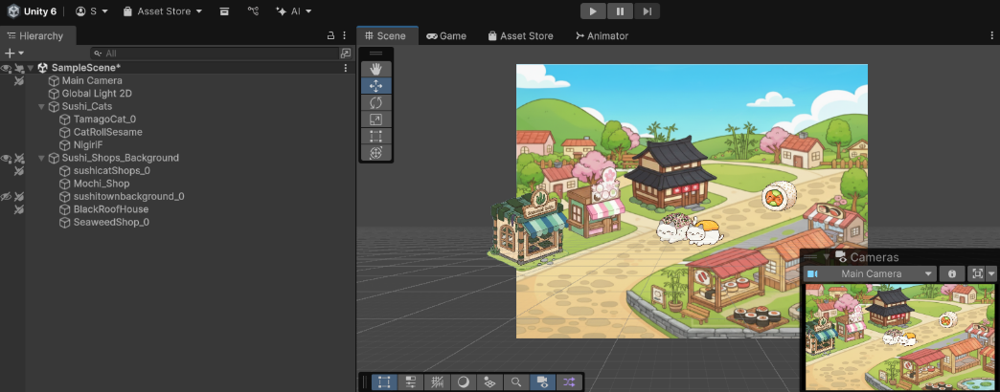

  

For a Programming Animations class, I created a short 2D animation in Unity inspired by two of my personal interests — sushi and cats. The project began with a brainstorming and pitch phase, where I presented my concept to classmates and incorporated their feedback before moving into development.
 
Through this project, I gained hands-on experience with Unity's animation system, organizing and importing hand-drawn assets, and bringing a creative concept to life as a functional animated sequence.

Here is the [outcome.](https://docs.google.com/videos/d/1F7bUThjJELsIEZolWEH8ADqMWkOCbyRKf6WD8DadKpo/edit?usp=sharing)

